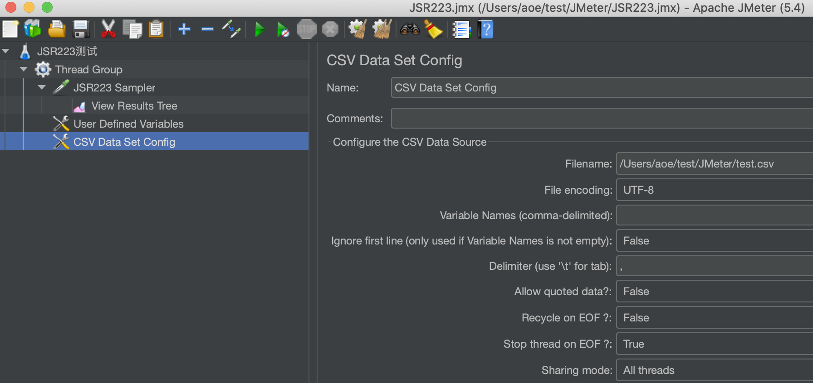
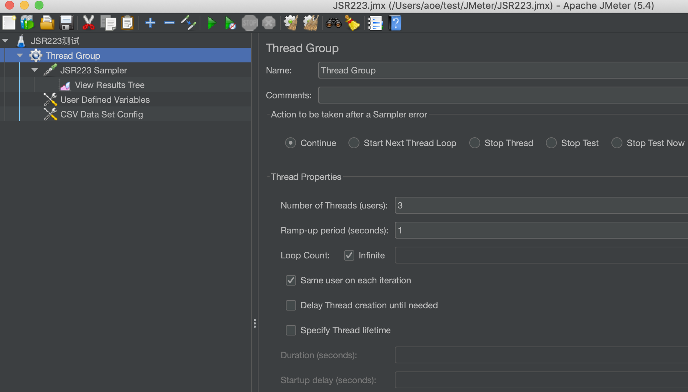
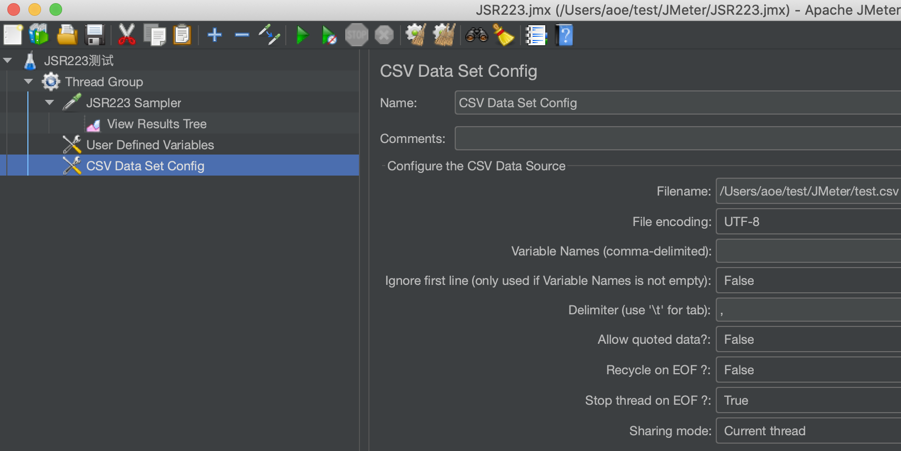
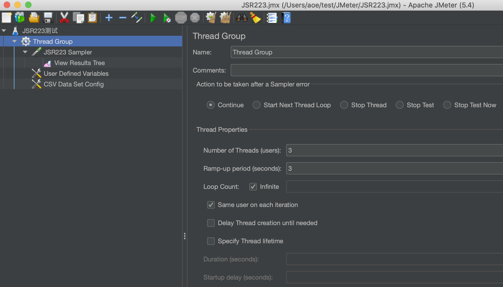

# JMeter 从 CSV 文件中读取数据

- 官方说明 [CSV Data Set Config](https://jmeter.apache.org/usermanual/component_reference.html#CSV_Data_Set_Config)

- JSR223 Sampler（测试代码）
```groovy
println(ctx.getThreadNum() + " " + vars.get("p1") + " " + vars.get("p2"));
```
- EOF: end of file

## 1. 遍历整个文件的数据（多个线程不会重复读取数据）
- [test.csv](data/test.csv)

### CSV Data Set Config
- Recycle on EOF = **False**
- Stop thread on EOF = **True**
- Sharing mode = **All threads**



### Thread Group
- Number of Threads (users) = 3 // 任意数值都可以
- Loop Count = Infinite


## 2. 每个线程遍历一遍 CSV 文件中的数据

- test.csv
```csv
p1,p2
a-1,b-1
a-2,b-2
```
- 输出结果
```cmd
0 a-1 b-1
0 a-2 b-2
1 a-1 b-1
1 a-2 b-2
2 a-1 b-1
2 a-2 b-2
```
### CSV Data Set Config


### Thread Group
